# Resume Analyzer

An AI-powered application that analyzes resumes, extracts candidate information, and matches candidates to job requirements using a local LLM.


---

## Features

- **Resume Upload & Processing** — Upload PDF, DOC, DOCX, or ZIP files with real-time progress tracking via SSE
- **AI-Powered Extraction** — Automatic candidate info extraction using local LLM (LM Studio)
- **Vector Search** — Semantic similarity search via pgvector embeddings
- **Candidate Matching** — AI-scored matching against job requirements (skills, experience, education, domain)
- **Agentic RAG Pipeline** — 6-step enrichment pipeline with web search (Tavily), profile staleness management, and multi-pass matching for borderline candidates
- **Skills Management** — Centralized skills master with 70+ pre-populated skills across multiple categories
- **RBAC** — JWT-based auth with 4 roles (Admin, Recruiter, HR, Hiring Manager)
- **Match Auditing** — Every match run is audited with scores, tokens, duration, and status tracking
- **Async Processing** — Apache Pekko actor pipeline for non-blocking resume processing

---

## Screenshots

### Resume Upload & Tracking
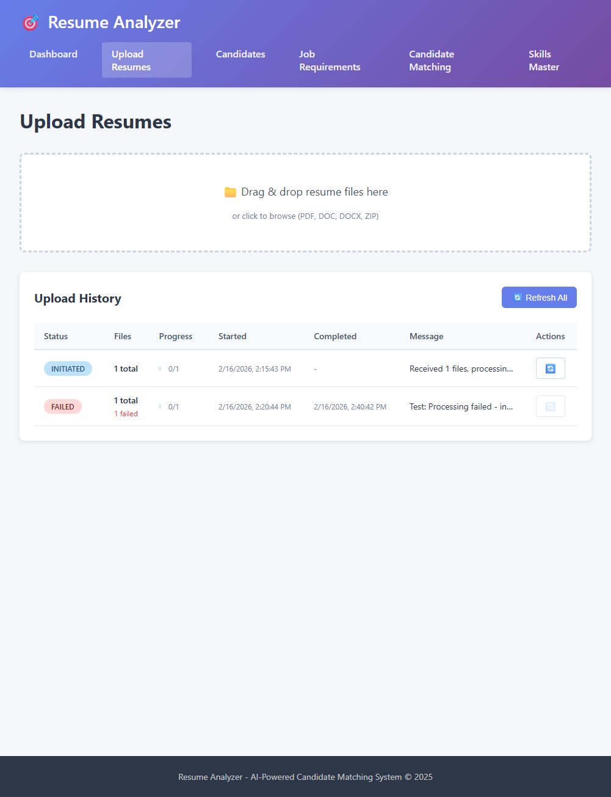

### Candidates List
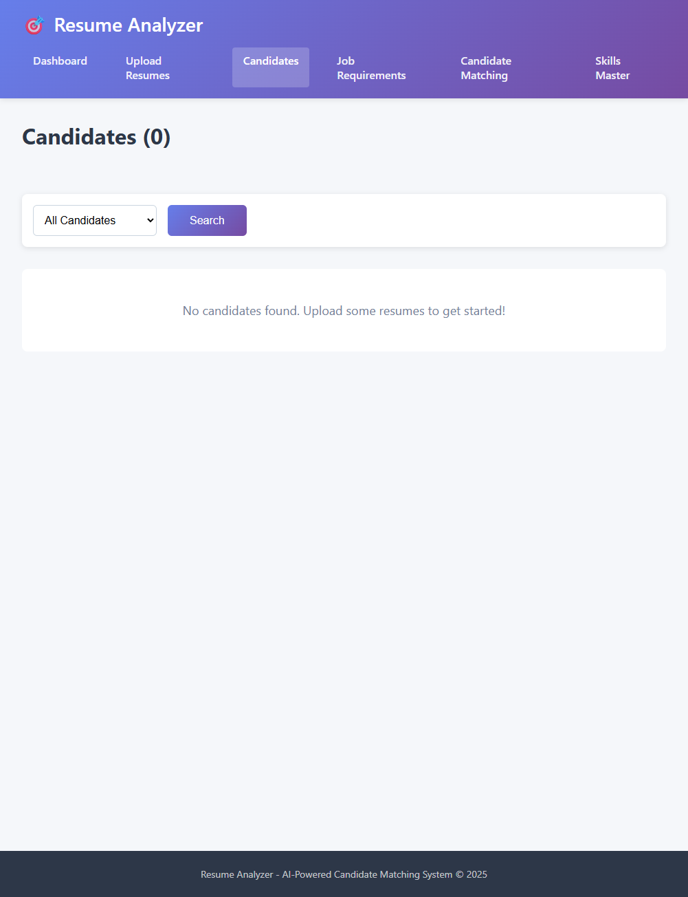

### Job Requirements
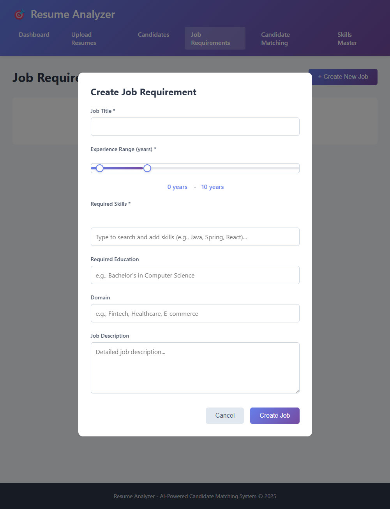

### Skills Master
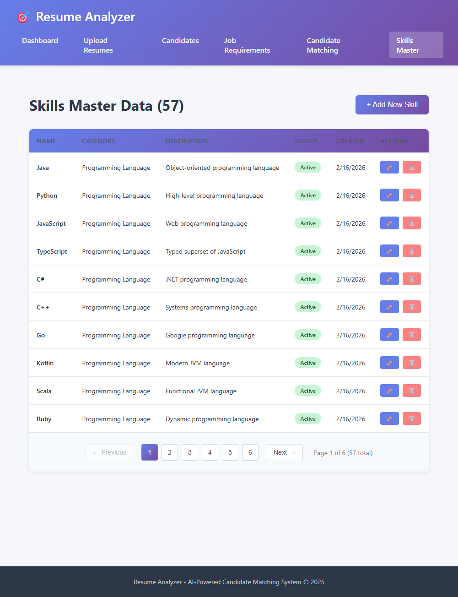

### Candidate Matching


### Admin Dashboard
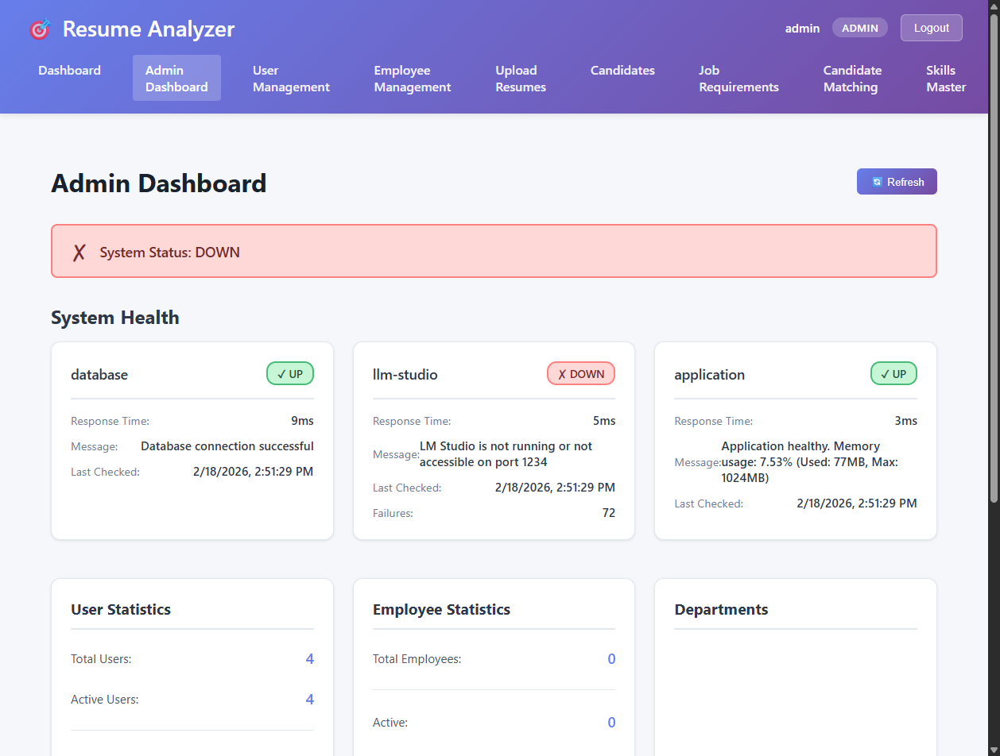

### Login
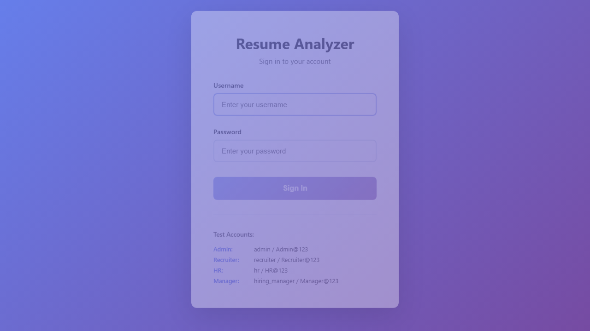

### Collapsible Sidebar
| Expanded | Collapsed |
|----------|-----------|
| 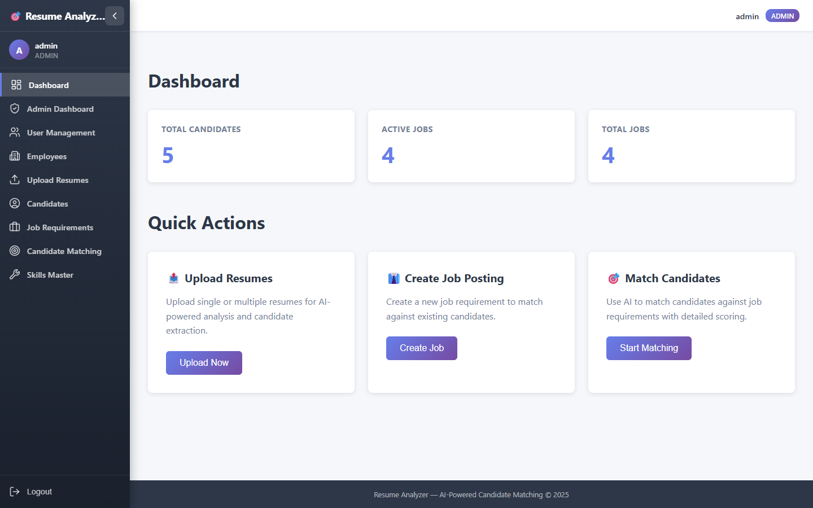 | 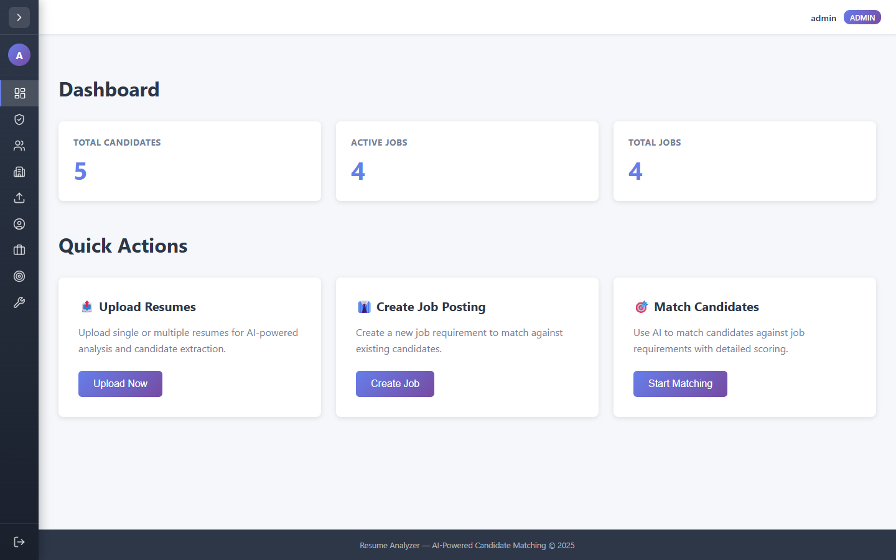 |

### Matching — Loading & Results
| Loading Overlay | Results |
|-----------------|---------|
| 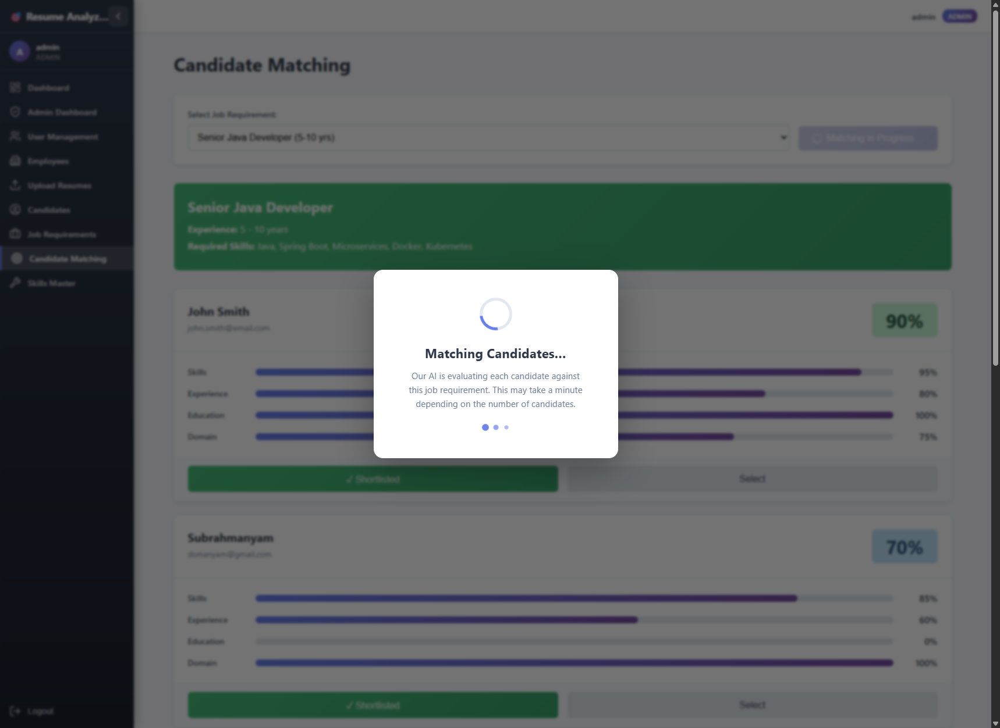 |  |

### Match Audit Panel


### Profile Enrichment
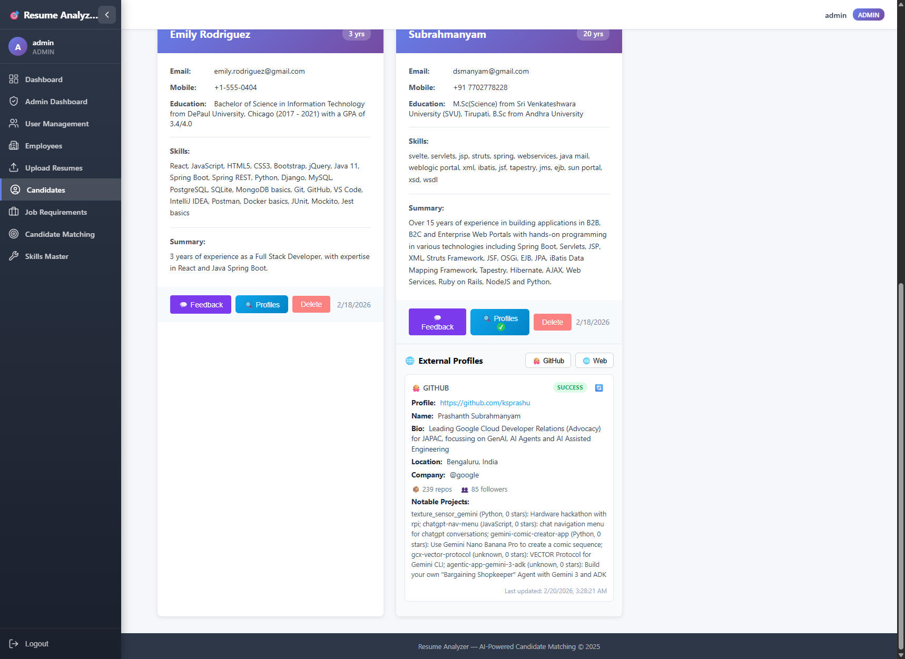

### Matching with Profile Badges
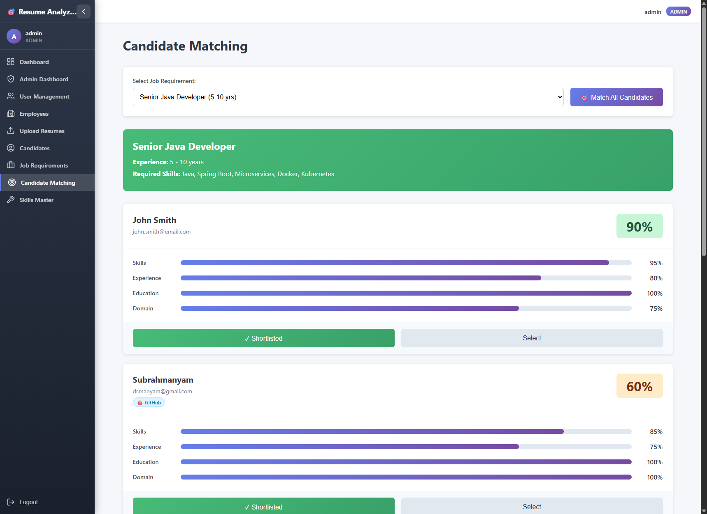

---

## Tech Stack

### Backend
- **Java 21** + **Spring Boot 3.2.2**
- **Spring AI 1.0.0-M6** (OpenAI-compatible client → LM Studio)
- **PostgreSQL 15+** with **pgvector**
- **GraphQL** (queries/mutations) + **REST** (file uploads, auth) + **SSE** (live status)
- **Apache Pekko 1.6.0** — async actor pipeline for resume processing
- **Spring Security** + **JJWT** — JWT auth with access / refresh / SSE tokens
- **Flyway** migrations, **Hibernate**, **Apache POI** + **PDFBox** for parsing

### Frontend
- **React 18** + **TypeScript 5**
- **Redux Toolkit 2** + **Redux-Saga**
- **Vite 5** + **CSS Modules**
- **Vitest** + **React Testing Library** + **MSW** (unit) / **Playwright** (E2E)

---

## Getting Started

### Prerequisites

| Tool | Version |
|------|---------|
| Java | 21+ |
| Node.js | 20.11.0+ |
| Yarn | 1.22.19+ |
| PostgreSQL | 15+ (with pgvector) |
| LM Studio | Latest |

### 1. Database Setup

```sql
CREATE DATABASE resume_analyzer;
\c resume_analyzer;
CREATE EXTENSION vector;
```

Update `application.yml` with your database credentials.

### 2. LLM Studio Setup

1. Download [LM Studio](https://lmstudio.ai/)
2. Load models:
   - **Chat**: `mistralai/ministral-3-14b-reasoning`
   - **Embedding**: `nomic-embed-text` (768 dimensions)
3. Start the local server on `http://localhost:1234`
4. *(Optional)* Set an API key under **Developer → API Key** and export it as `LLM_STUDIO_API_KEY`

See [LLM-STUDIO-SETUP.md](docs/LLM-STUDIO-SETUP.md) for details.

### 3. Backend

```bash
mvn clean install
mvn spring-boot:run
```

Runs on `http://localhost:8080` — GraphQL playground at `/graphiql`

### 4. Frontend

```bash
cd src/main/frontend
yarn install
yarn dev
```

Runs on `http://localhost:3000`

---

## Authentication & Roles

| Role | Access |
|------|--------|
| `ADMIN` | Full access — users, employees, system health, all CRUD |
| `RECRUITER` | Jobs (CRUD) + Candidates + Upload + Matching |
| `HR` | Employees + Candidates (read) + Matching |
| `HIRING_MANAGER` | Jobs (read-only) + Candidates + Matching |

### Default Test Users

| Username | Password | Role |
|----------|----------|------|
| `admin` | `Admin@123` | ADMIN |
| `recruiter` | `Recruiter@123` | RECRUITER |
| `hr` | `HR@123` | HR |
| `hiring_manager` | `Manager@123` | HIRING_MANAGER |

---

## Configuration

Create a `.env` file (see [.env.example](docs/.env.example)):

```properties
POSTGRES_HOST=localhost
POSTGRES_PORT=5432
POSTGRES_DB=resume_analyzer
POSTGRES_USER=postgres
POSTGRES_PASSWORD=your_password

LLM_STUDIO_BASE_URL=http://localhost:1234
LLM_STUDIO_API_KEY=not-needed
LLM_STUDIO_MODEL=mistralai/ministral-3-14b-reasoning
LLM_STUDIO_EMBEDDING_MODEL=nomic-embed-text

SERVER_PORT=8080
```

> **Note:** `LLM_STUDIO_BASE_URL` must **not** include `/v1` — Spring AI appends it automatically.

---

## Project Structure

```
resume-analyzer/
├── src/main/
│   ├── java/io/subbu/ai/firedrill/
│   │   ├── config/            # Security, JWT, Spring config
│   │   ├── controller/        # REST controllers (upload, auth)
│   │   ├── entities/          # JPA entities
│   │   ├── models/            # DTOs, enums
│   │   ├── pekko/             # Apache Pekko actor pipeline
│   │   ├── repos/             # Spring Data repositories
│   │   ├── resolver/          # GraphQL resolvers
│   │   └── services/          # Business logic
│   ├── resources/
│   │   ├── application.yml
│   │   ├── db/                # Flyway migrations
│   │   └── graphql/schema.graphqls
│   └── frontend/
│       ├── src/
│       │   ├── components/    # Reusable React components
│       │   ├── pages/         # Page components
│       │   ├── store/         # Redux store, slices, sagas
│       │   ├── services/      # GraphQL & REST clients
│       │   └── types/         # TypeScript types
│       └── tests/e2e/         # Playwright E2E tests
├── docker/                    # Docker Compose + Dockerfile
├── docs/                      # Architecture & API docs
├── test-data/                 # Sample resumes
└── pom.xml
```

---

## Testing

| Suite | Tests | Tools |
|-------|-------|-------|
| Backend Unit | 169 (0 failures) | JUnit 5, Mockito, Testcontainers |
| Frontend Unit | 94 (100% passing) | Vitest, React Testing Library, MSW |
| E2E | 103 (100% passing) | Playwright (multi-browser) |
| **Total** | **366** | |

```bash
# Backend
mvn test

# Frontend unit tests
cd src/main/frontend && yarn test

# E2E tests
cd src/main/frontend && yarn test:e2e

# Everything
mvn clean test && cd src/main/frontend && yarn test && yarn test:e2e
```

---

## Production Build

```bash
mvn clean package
java -jar target/resume-analyzer-1.0.0.jar
```

The Maven build installs Node/Yarn, builds the React frontend, and packages everything into a single executable JAR.

---

## Troubleshooting

| Problem | Solution |
|---------|----------|
| LLM Studio connection failed | Ensure LM Studio is running on `localhost:1234` with a model loaded |
| Auth failed on health check | Check `LLM_STUDIO_API_KEY` matches LM Studio's Developer → API Key |
| pgvector extension missing | Run `CREATE EXTENSION vector;` in your database |
| Frontend API calls failing | Check Vite proxy config and that backend is on port 8080 |
| Build failures | Run `mvn clean` and delete `node_modules`, then reinstall |

---

## Documentation

| Document | Description |
|----------|-------------|
| [ARCHITECTURE.md](docs/ARCHITECTURE.md) | System architecture with UML diagrams |
| [AGENTIC-RAG.md](docs/AGENTIC-RAG.md) | Agentic enrichment pipeline walkthrough |
| [GRAPHQL-API.md](docs/GRAPHQL-API.md) | Complete GraphQL API reference |
| [DOCKER-DEPLOYMENT.md](docs/DOCKER-DEPLOYMENT.md) | Docker deployment guide |
| [LLM-STUDIO-SETUP.md](docs/LLM-STUDIO-SETUP.md) | LM Studio configuration |
| [FUTURE-ENHANCEMENTS.md](docs/FUTURE-ENHANCEMENTS.md) | Roadmap with 50+ proposals |
| [NEXT-STEPS.md](docs/NEXT-STEPS.md) | Implementation phases |
| [SKILLS-MANAGEMENT.md](docs/SKILLS-MANAGEMENT.md) | Skills master data guide |

---

## Contributing

1. Follow the existing package structure
2. Write unit tests for new services
3. Update `schema.graphqls` when adding new types
4. Use TypeScript strict mode for frontend code

## License

This project is licensed under the MIT License — see the [LICENSE](LICENSE) file for details.
